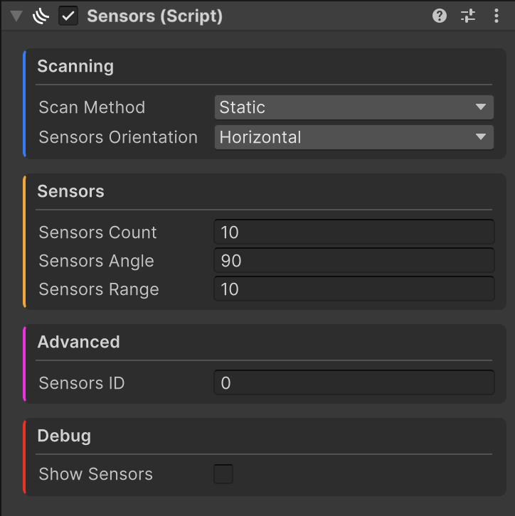

---
layout:
  title:
    visible: true
  description:
    visible: false
  tableOfContents:
    visible: true
  outline:
    visible: true
  pagination:
    visible: true
---

# Sensors Component


**Essentials.Core.Sensors** namespace is needed for this.


The Sensors component is used to sense game objects by casting a bunch of raycasts in parallel. It utilizes the Jobs system and Burst compilation for the best efficiency possible.

<figure><figcaption>
Sensors component properties
</figcaption></figure>


Due to how the sensors count is implemented in code, you **SHOULD** **NOT** change the sensors count property during runtime. Doing so will result in a bunch of errors.


## Configuring the Scanning

<figure><figcaption>
Static scan method properties
</figcaption></figure>

The scanning category has a bunch of configuration options that control how the sensors should behave, and whether they are static or dynamic.

### Scan Methods

Scan method is the main option responsible for the behavior of the sensors. There are two categories of scan methods: **static** (which is the static scan method) and **dynamic** (which are the rest of the methods).

### Static Scan Method

The default one is the **static** **scan method**, which means that the sensors cast are stationary and there is no dynamic movement involved.

<figure><figcaption>
Static horizontal sensors
</figcaption></figure>

<figure><figcaption>
Static vertical sensors
</figcaption></figure>

### Vertical Scan Method

<figure><figcaption>
Vertical scan method properties
</figcaption></figure>

The **vertical** **scan method** is used to dynamically move the sensors during runtime in a vertical motion. Useful for when you want to cover large vertical areas with just a few sensors.

The **scan angle amplitude** property tells the system how much the sensors move up and down.

The **scan angle frequency** property tells the system how fast it moves up and down.

<figure><figcaption>
Vertical scan method with horizontal sensors orientation
</figcaption></figure>

### Horizontal Scan Method

<figure><figcaption>
Horizontal scan method properties
</figcaption></figure>

The **horizontal** **scan method** is used to dynamically move the sensors during runtime in a horizontal motion. Useful for when you want to cover large horizontal areas with just a few sensors.

The **scan angle amplitude** property tells the system how much the sensors move left and right.

The **scan angle frequency** property tells the system how fast it moves left and right.

<figure><figcaption>
Horizontal scan method with vertical sensors orientation
</figcaption></figure>

### Random Scan Method

<figure><figcaption>
Random scan method properties
</figcaption></figure>

The **random** **scan method** moves the sensors by a random value up, down, left or right, depending on the configuration.

The **random scan type** property defines whether the random movement is **horizontal** – left and right, or **vertical** – up and down.

The **horizontal or vertical randomization** property (depends on the random scan type) defines what is the maximum amount that the sensors can move randomly in the configured direction.

<figure><figcaption>
Random horizontal scan method with vertical random scan type
</figcaption></figure>

### Sensors Orientation

The **sensors orientation** property controls whether the sensors should be laid out vertically, horizontally or in both directions, depending on the use case. This property is available for every scan method.

## Configuring the Sensors

<figure><figcaption>
Sensors category
</figcaption></figure>

The sensors can be configured in the Sensors category, which contains the sensors count, sensors angle and sensors range properties.

* **Sensors Count** – Sets the amount of sensors that should be cast from the game object.
* **Sensors Angle** – Sets the spread angle of the sensors in degrees that should be cast from the game object.
* **Sensors Range** – Sets the maximum allowed range in meters that the sensors can travel.


The **Sensors Angle** property is split into two – vertical and horizontal – when the sensors orientation is set to **Both**.


## Configuring the Sensors ID

<figure><figcaption>
Sensors ID property
</figcaption></figure>

The Sensors component detects only those receivers that have the same ID as the Sensors Receiver component. By default, every Sensors and Sensors Receiver component has the same ID, which is **0**. This means that **every** **Sensors component** detects **every** **Sensors Receiver component**. To change this, you can modify the Sensors ID property so that only **certain sensors detect certain receivers**.

## Debugging the Sensors

<figure><figcaption>
Debug category
</figcaption></figure>

There are two options available for debugging that provide a visualization of the sensors in action.

* **Show Sensors** – Shows the sensors being cast from the game object during runtime.
* **Show Sensor Hits** – Turns on color coding. Sensors that do not detect any game objects are shown in <mark style="color:green;">**green**</mark>, indicating a clear path, while sensors that register a hit, meaning they have detected a game object, are displayed in <mark style="color:red;">**red**</mark>.
