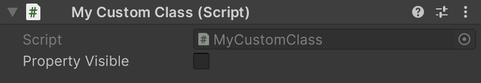
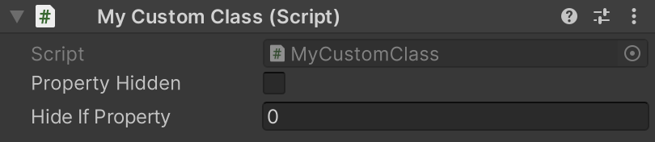

# Essentials Inspector


**Essentials.Inspector** namespace is needed for this.


The Essentials Inspector has a few attributes that can help you customize your inspector properties a little bit better.

## FieldColor

A `FieldColor` attribute changes the color of a property's field.


```cs
using Essentials.Inspector;
using UnityEngine;

public class MyCustomClass : MonoBehaviour
{
    [FieldColor(255, 0, 0)] public int _aRedProperty;
    [FieldColor(0, 255, 0)] public int _aGreenProperty;
    [FieldColor(0, 0, 255)] public int _aBlueProperty;
}
```


<figure><figcaption><p>FieldColor attribute example</p></figcaption></figure>

## LabelColor

A `LabelColor` attribute changes the color of a property's label and value.


```cs
using Essentials.Inspector;
using UnityEngine;

public class MyCustomClass : MonoBehaviour
{
    [LabelColor(255, 0, 0)] public int _aRedLabel;
    [LabelColor(0, 255, 0)] public int _aGreenLabel;
    [LabelColor(0, 0, 255)] public int _aBlueLabel;
}
```


<figure><figcaption><p>LabelColor attribute example</p></figcaption></figure>

## ReadOnly

A `ReadOnly` attribute disables the ability to modify a property and makes it greyed out.


```cs
using Essentials.Inspector;
using UnityEngine;

public class MyCustomClass : MonoBehaviour
{
    public int normalProperty;
    [ReadOnly] public int readOnlyProperty;
}
```


<figure><figcaption><p>ReadOnly attribute example</p></figcaption></figure>

## SetIndentLevel

A `SetIndentLevel` attribute sets the indent level of a property.


```cs
using Essentials.Inspector;
using UnityEngine;

public class MyCustomClass : MonoBehaviour
{
    public int normalProperty;
    [SetIndentLevel(1)] public int indentedProperty;
}
```


<figure><figcaption><p>SetIndentLevel attribute example</p></figcaption></figure>

## ShowIf

A `ShowIf` attribute shows a property based on a specified condition.


```cs
using Essentials.Inspector;
using UnityEngine;

public class MyCustomClass : MonoBehaviour
{
    public bool propertyVisible;
    [ShowIf("propertyVisible", true)] public int showIfProperty;
}
```


<div align="center" data-full-width="false">

<figure><figcaption><p>ShowIf attribute example (false)</p></figcaption></figure>

</div>

<figure><figcaption><p>ShowIf attribute example (true)</p></figcaption></figure>

## HideIf

A `HideIf` attribute hides a property based on a specified condition.


```cs
using Essentials.Inspector;
using UnityEngine;

public class MyCustomClass : MonoBehaviour
{
    public bool propertyHidden;
    [HideIf("propertyHidden", true)] public int hideIfProperty;
}
```


<figure><figcaption><p>HideIf attribute example (false)</p></figcaption></figure>

<figure><figcaption><p>HideIf attribute example (true)</p></figcaption></figure>

## DisableIf

A `DisableIf` attribute makes a property read-only based on a specified condition.


```cs
using Essentials.Inspector;
using UnityEngine;

public class MyCustomClass : MonoBehaviour
{
    public bool propertyDisabled;
    [DisableIf("propertyDisabled", true)] public int disableIfProperty;
} 
```


<figure><figcaption><p>DisableIf attribute example (false)</p></figcaption></figure>

<figure><figcaption><p>DisableIf attribute example (true)</p></figcaption></figure>

## EnableIf

A `EnableIf` attribute makes a property writable based on a specified condition.


```cs
using Essentials.Inspector;
using UnityEngine;

public class MyCustomClass : MonoBehaviour
{
    public bool propertyEnabled;
    [EnableIf("propertyEnabled", true)] public int enableIfProperty;
} 
```


<figure><figcaption><p>EnableIf attribute example (false)</p></figcaption></figure>

<figure><figcaption><p>EnableIf attribute example (true)</p></figcaption></figure>

## Comparing Values

Attributes like `ShowIf`, `HideIf`, `EnableIf`, `DisableIf`, and so on..., can compare not only boolean values but almost any kind of value. Most notably `float`, `int` and `string`.


```cs
using Essentials.Inspector;
using UnityEngine;

public class MyCustomClass : MonoBehaviour
{
    public int intCondition;
    [ShowIf("intCondition", 2)] public int showInt;

    public float floatCondition;
    [ShowIf("floatCondition", 1.5f)] public float showFloat;

    public string stringCondition;
    [ShowIf("stringCondition", "MyString")] public string showString;
}
```


### Comparing Int and Float Values With Operators

What if you want the value to be for example less or equal than something? For that you can make it a string and insert operators.\
Valid operators are: `>`, `>=`, `<`, `<=`, `==`, `!=`.


```cs
using Essentials.Inspector;
using UnityEngine;

public class MyCustomClass : MonoBehaviour
{
    public int lessCondition;
    [ShowIf("lessOrEqualCondition", "<2")] public int showIfLess;

    public int lessOrEqualCondition;
    [ShowIf("lessOrEqualCondition", "<=2")] public int showIfLessOrEqual;

    public int greaterCondition;
    [ShowIf("greaterOrEqualCondition", ">2")] public int showIfGreater;

    public int greaterOrEqualCondition;
    [ShowIf("greaterOrEqualCondition", ">=2")] public int showIfGreaterOrEqual;

    public int equalCondition;
    [ShowIf("equalCondition", "==2")] public int showIfEqual;

    public int notEqualCondition;
    [ShowIf("notEqualCondition", "!=2")] public int showIfNotEqual;
}
```


The same goes with float values.


```cs
using Essentials.Inspector;
using UnityEngine;

public class MyCustomClass : MonoBehaviour
{
    public float lessCondition;
    [ShowIf("lessCondition", "<2.5f")] public float showIfLess;

    public float lessOrEqualCondition;
    [ShowIf("lessOrEqualCondition", "<=2.5f")] public float showIfLessOrEqual;

    public float greaterCondition;
    [ShowIf("greaterCondition", ">2.5f")] public float showIfGreater;

    public float greaterOrEqualCondition;
    [ShowIf("greaterOrEqualCondition", ">=2.5f")] public float showIfGreaterOrEqual;

    public float equalCondition;
    [ShowIf("equalCondition", "==2.5f")] public float showIfEqual;

    public float notEqualCondition;
    [ShowIf("notEqualCondition", "!=2.5f")] public float showIfNotEqual;
}
```


### Comparing Multiple Values

You are not restricted to comparing only one value. You can compare multiple values. Simply separate them by a comma.


```cs
using Essentials.Inspector;
using UnityEngine;

public class MyCustomClass : MonoBehaviour
{
    public float multipleValueCondition;
    [ShowIf("multipleValueCondition", ">2f", "<3f")] public float multipleValueProperty;
}
```


### Compare Types

By default, when comparing multiple values, the compare type is set to `CompareType.All` which means that all of the values need to be satisfied. To change this, simply pass `CompareType.Any` to an attribute before passing any values. Now only one value needs to be satisfied.


```cs
using Essentials.Inspector;
using UnityEngine;

public class MyCustomClass : MonoBehaviour
{
    public float multipleValueCondition;
    [ShowIf("multipleValueCondition", CompareType.Any, "<3f", ">10f")] public float multipleValueProperty;
}
```

